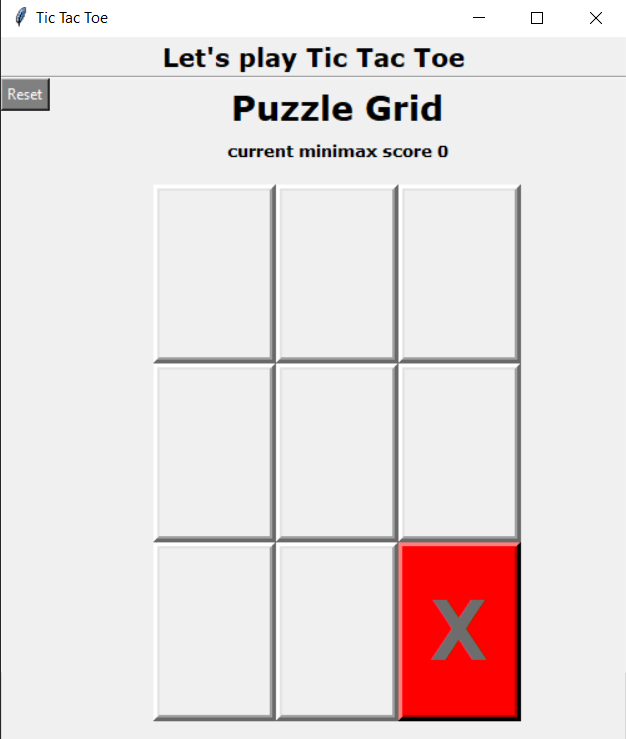

# QUIZ 2 OF DESIGN & ANALYSIS OF ALGORITHMS

## Members:
| Name                          | NRP        |
|-------------------------------|------------|
| Ezekiel Mashal Wicaksono      | 5025201140 |
| Marsyavero Charisyah Putra    | 5025201122 |
| David Fischer Simanjuntak     | 5025201123 |

### Preface
The Minimax algorithm was used in our second quiz project. It is an Adversarial Search, a search in which a "enemy" or "opponent" affects the state of the problem at every step in an undesirable direction. The software must consider the "opponent's" next state, which cannot be anticipated with confidence. This search can engage in two kinds of games: general games and zero-sum games.

We chose an issue that was also a game of tic-tac-toe. This game can be solved using the Minimax technique, which is designed to solve zero-sum games like this one and is simple to understand when demonstrated.

### Solution Abstraction
To begin, let's start by defining what it means to play a perfect game of tic tac toe:

If I play flawlessly, I will either win or draw every game. Furthermore, if I play against another perfect player, I will always draw the game.

How might we describe these situations quantitatively? Let's assign a score to the "end game conditions":

- I win, I get 10 points.
- I lose, I lose 10 points (because the other player gets 10 points).
- I draw, I get zero points, nobody gets any points.

So now we have a situation where we can determine a possible score for any game end state.

The Minimax algorithm relies on a back and forth between the two players, with the player whose "turn it is" wishing to select the move with the highest score. In turn, the opposing player decides which of its available moves has the lowest score, which determines the scores for each of the available moves. The scores for the opposing player's movements are set once again by the turn-taking player attempting to maximize its score, and so on all the way down the move tree to an end state.

A description for the algorithm, assuming X is the "turn taking player," would look something like:

-	If the game is over, return the score from X's perspective.
-	Otherwise get a list of new game states for every possible move
-	Create a scores list
-	For each of these states add the minimax result of that state to the scores list
-	If it's X's turn, return the maximum score from the scores list
-	If it's O's turn, return the minimum score from the scores list

This procedure is recursive; it switches back and forth between the participants until a final score is found. 

To determine whether the current move is better than the best move, we use the minimax() function, which considers all possible outcomes of the game and returns the best value for that move, providing the opponent is also playing optimally.

Here is the Pseudocode for the minimax() function:

```
function minimax(board, depth, isMaximizingPlayer):

    if current board state is a terminal state :
        return value of the board
    
    if isMaximizingPlayer :
        bestVal = -INFINITY 
        for each move in board :
            value = minimax(board, depth+1, false)
            bestVal = max( bestVal, value) 
        return bestVal

    else :
        bestVal = +INFINITY 
        for each move in board :
            value = minimax(board, depth+1, true)
            bestVal = min( bestVal, value) 
        return bestVal
```

And this is how to set the minimizer and maximizer score:

```
def score(game)
    if game.win?(@player)
        return 10
    elsif game.win?(@opponent)
        return -10
    else
        return 0
    end
end
```

Instead of text-based UIs, written command labels, or text navigation, graphical user interfaces (GUIs) allow users to interact with electronic devices through graphical icons and auditory indicators such as primary notation. The introduction of graphical user interfaces (GUIs) was in response to the perceived steep learning curve of command-line interfaces (CLIs), which need commands to be typed on a computer keyboard.

Tkinter is a Python binding to the Tk GUI toolkit. It is the standard Python interface to the Tk GUI toolkit, and is Python’s de facto standard GUI. It is a fast and easy way of creating GUI applications.

**GUI Layout:**

